# Real-Time Crypto Price Pipeline with Alerts & Dashboard

This project is a complete end-to-end data engineering solution that fetches real-time cryptocurrency data, stores it in a PostgreSQL database, sends alerts for specific market events, and visualizes the data through an interactive Streamlit dashboard.

## Features

- **Real-Time Data Ingestion**: Fetches the latest market data for specified cryptocurrencies from the CoinGecko API.
- **Robust Data Pipeline**: Includes retry logic with exponential backoff (`tenacity`) and data validation to ensure data quality and handle transient API failures.
- **Persistent Storage**: Stores historical price data and API error logs in a PostgreSQL database.
- **Advanced Alerting System**:
  - Sends notifications for significant price drops and volume spikes over a configurable time window.
  - Detects and alerts on market cap overtakes between coins.
  - Delivers alerts via multiple channels (Email & Telegram).
- **Interactive Dashboard**: A Streamlit web application that provides:
  - An auto-refreshing overview of the latest prices and market cap distribution.
  - A detailed price analysis tab with interactive Line and Candlestick charts.
  - Technical analysis tools including Moving Averages and Bollinger Bands.
  - Date range selectors and data download (CSV) functionality.
  - A system logs viewer to monitor pipeline health.

## Project Pipeline Architecture

```mermaid
flowchart LR
    %% External Data Source Layer
    API["🌐 CoinGecko API<br/>REST Endpoint<br/>5-min intervals"]
    
    %% Configuration & Scheduler
    subgraph Controls ["Management & Automation"]
        ENV["🔒 .env Config<br/>Secrets Management<br/>DB_PASSWORD<br/>EMAIL_SENDER_PASSWORD"]
        SCHEDULER["⏰ Task Scheduler<br/>Cron Jobs / Task Scheduler<br/>Interval: 5 minutes"]
    end
    
    %% Core Pipeline
    PIPELINE["⚙️ Data Pipeline<br/>crypto_realtime_alerts_pipeline.py<br/><br/>1️⃣ Fetch Data (requests)<br/>2️⃣ Transform (pandas)<br/>3️⃣ Alert Logic<br/>4️⃣ Store to DB"]
    
    %% Alert Logic Center
    ALERTS["🔔 Alert Triggers<br/><br/>📉 Price Drop ≥ 5%<br/>📊 Volume Spike ≥ 50%<br/>🚀 Market Cap Overtake<br/>📈 24h Change ≤ -10%"]
    
    %% Storage Layer
    DB["💾 PostgreSQL Database<br/>Port: 5432<br/><br/>📄 coin_price_data<br/>⚠️ api_error_logs<br/><br/>Indexes: coin_id, timestamp"]
    
    %% Notification Channels
    subgraph Notifications ["Outbound Alerts"]
        EMAIL["📧 Email Alerts<br/>Gmail SMTP<br/>Port: 587 (TLS)"]
        TELEGRAM["💬 Telegram Bot<br/>Instant push notifications<br/>Markdown formatting"]
    end
    
    %% Presentation Layer
    DASHBOARD["📊 Streamlit Dashboard<br/>crypto_dashboard.py<br/>Port: 8501<br/><br/>📈 Price Charts | 📊 Bollinger Bands<br/>📉 Moving Averages | 💾 CSV Export<br/><br/>Auto-refresh: 65s"]
    
    %% Data Flow Connections
    API -->|"JSON Response<br/>BTC, ETH, SOL, ADA, DOGE"| PIPELINE
    ENV -.->|"Load credentials"| PIPELINE
    SCHEDULER -.->|"Trigger execution"| PIPELINE
    
    PIPELINE -->|"SQLAlchemy ORM<br/>df.to_sql()"| DB
    PIPELINE -->|"Evaluate conditions"| ALERTS
    
    ALERTS -->|"if triggered"| EMAIL
    ALERTS -->|"if triggered"| TELEGRAM
    
    DB -->|"SQL Queries<br/>pd.read_sql()<br/>st.cache_data(ttl=60)"| DASHBOARD
    
    %% Error Handling
    PIPELINE -.->|"Log errors"| DB
    
    %% Styling
    classDef apiStyle fill:#10b981,stroke:#059669,stroke-width:3px,color:#fff
    classDef pipelineStyle fill:#3b82f6,stroke:#2563eb,stroke-width:3px,color:#fff
    classDef dbStyle fill:#8b5cf6,stroke:#7c3aed,stroke-width:3px,color:#fff
    classDef alertStyle fill:#ef4444,stroke:#dc2626,stroke-width:3px,color:#fff
    classDef notifStyle fill:#f59e0b,stroke:#d97706,stroke-width:3px,color:#fff
    classDef dashStyle fill:#eab308,stroke:#ca8a04,stroke-width:3px,color:#fff
    classDef configStyle fill:#f97316,stroke:#ea580c,stroke-width:3px,color:#fff
    
    class API apiStyle
    class PIPELINE pipelineStyle
    class DB dbStyle
    class ALERTS alertStyle
    class EMAIL,TELEGRAM notifStyle
    class DASHBOARD dashStyle
    class ENV,SCHEDULER configStyle
```



## Project Structure

- `crypto_realtime_alerts_pipeline.py`: The core data pipeline script responsible for fetching, validating, storing, and alerting on new data. Designed to be run on a schedule.
- `crypto_dashboard.py`: The Streamlit web application that connects to the database and visualizes the data.
- `.env`: A file (that you create) to securely store environment variables like API keys and passwords.
- `test_seeder.py`: A utility script to seed the database with test data to verify alert functionality.

## Setup and Installation

### 1. Prerequisites

- Python 3.8+
- PostgreSQL server installed and running.

### 2. Clone the Repository

```sh
git clone <your-repository-url>
cd RealTimeCryptoPricePipelineWithAlerts
```

### 3. Set Up Environment and Install Dependencies

It is highly recommended to use a virtual environment.

```sh
# Create and activate a conda environment
conda create --name crypto-pipeline python=3.9
conda activate crypto-pipeline

# Install required packages
pip install requests pandas sqlalchemy psycopg2-binary python-dotenv tenacity streamlit streamlit-autorefresh plotly
```

### 4. Database Setup

1.  Open your PostgreSQL client (e.g., `psql` or pgAdmin).
2.  Create a new database named `cryptoalerts`.

    ```sql
    CREATE DATABASE "cryptoalerts";
    ```

### 5. Configure Environment Variables

1.  Create a file named `.env` in the root of the project directory.
2.  Add your credentials and API keys to this file. This file should **never** be committed to version control.

    ```ini
    # .env file

    # -- PostgreSQL Database Password --
    DB_PASSWORD="your_postgres_password"

    # -- Email Configuration (using Gmail App Password) --
    EMAIL_SENDER_ADDRESS="your_email@gmail.com"
    EMAIL_SENDER_PASSWORD="your_16_character_app_password"
    EMAIL_RECEIVER_ADDRESS="email_to_send_alerts_to@example.com"

    # -- Telegram Configuration --
    TELEGRAM_BOT_TOKEN="your_telegram_bot_token"
    TELEGRAM_CHAT_ID="your_telegram_chat_id"
    ```

### Using Supabase as the Database

If you are using Supabase, your configuration is slightly different. You need the **direct database connection info**, not the API keys.

1.  In your Supabase project, go to **Project Settings** > **Database**.
2.  Under **Connection string**, find the `Host`. It will look like `db.xxxxxxxx.supabase.co`.
3.  Your `.env` file should look like this:

    ```ini
    # .env file for Supabase
    DB_HOST="db.xxxxxxxx.supabase.co"
    DB_PASSWORD="your_supabase_project_password"
    ```

## Running the Project

The project consists of two main components that should be run in separate terminals.

### Step 1: Run the Data Pipeline

The pipeline script is designed to run once and then exit. It should be executed by a scheduler (see Deployment section below). To run it manually for the first time or for testing:

```sh
python crypto_realtime_alerts_pipeline.py
```

This will set up the database tables and indexes on the first run.

### Step 2: Run the Streamlit Dashboard

In a second terminal, run the following command:

```sh
streamlit run crypto_dashboard.py
```

This will start the web server and open the interactive dashboard in your browser.

## Deployment & Scheduling

To make this a true real-time pipeline, the `crypto_realtime_alerts_pipeline.py` script needs to be run periodically. The following guide explains how to set this up on Windows using Task Scheduler to run every 10 minutes.

### Scheduling with Windows Task Scheduler

1.  **Open Task Scheduler**: Press the Windows Key and search for "Task Scheduler".
2.  **Create Task**: In the "Actions" pane on the right, click **Create Task...** (do not use "Create Basic Task").
3.  **General Tab**:
    -   **Name**: Give it a descriptive name, like `Crypto Pipeline - 10min Run`.
    -   Select **"Run whether user is logged on or not"** to ensure it runs in the background.
4.  **Triggers Tab**:
    -   Click **New...**.
    -   **Begin the task**: `On a schedule`.
    -   **Settings**: Select `Daily`.
    -   **Advanced settings**:
        -   Check **"Repeat task every"**.
        -   Set the interval to **10 minutes**.
        -   Set the duration to **Indefinitely**.
        -   Ensure **"Enabled"** is checked at the bottom.
    -   Click **OK**.
5.  **Actions Tab**:
    -   Click **New...**.
    -   **Action**: `Start a program`.
    -   **Program/script**: You need the **full path** to the `python.exe` executable inside your Conda environment. You can find this by activating your environment and running `where python`. It will look something like: `C:\Users\xxx\.conda\envs\crypto-pipeline\python.exe`.
    -   **Add arguments (optional)**: Provide the **full path** to your pipeline script. For example: `C:\Users\xxx\RealTimeCryptoPricePipelineWithAlerts\crypto_realtime_alerts_pipeline.py`.
    -   **Start in (optional)**: Provide the directory where your script is located. This helps ensure that relative paths (like for the `.env` file) work correctly. For example: `C:\Users\xxx\RealTimeCryptoPricePipelineWithAlerts\`.
    -   Click **OK**.
6.  **Save the Task**: Click **OK** to save the task. You may be prompted to enter your Windows user password.

The task is now set up and will automatically execute your pipeline script every 10 minutes.